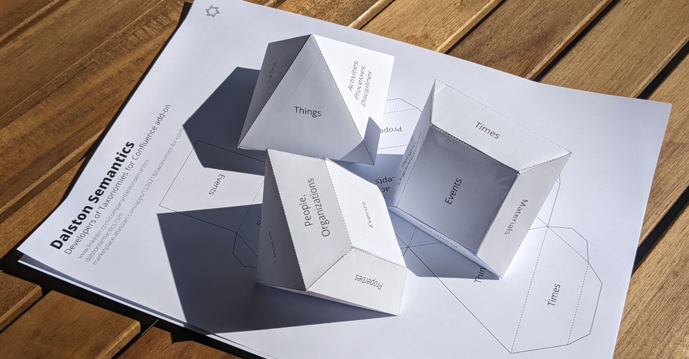

# Data governance stationery

Print this [outline of the foldable 3D shape to help communicate faceted classification ideas](dalston-semantics-controlled-vocabulary.pdf), cut it out, fold and glue it together. The result should look like this.

The list of facets used for this shape may be a good starting point, but it is not authoritative, and you may need to adopt a different one to suit your particular situation.

Inspired by the talks by [John O'Gorman](https://www.linkedin.com/in/john-o-gorman-b97ab2/) at the [Data Centric Architecture Forum in February 2020](https://www.dcaforum.com/) and Leonard Will at the [ISKO UK Meetup in March 2022](https://www.meetup.com/Knowledge-Organisation-London/events/284319067/).